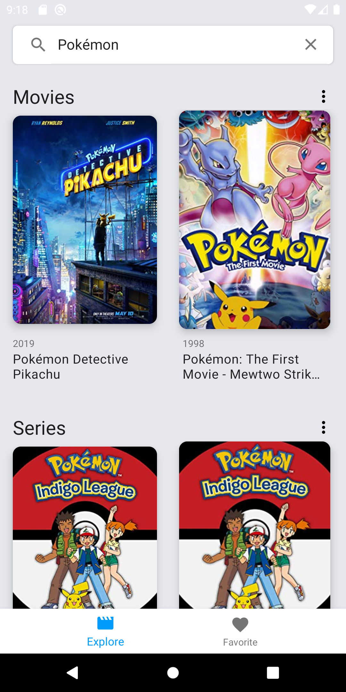
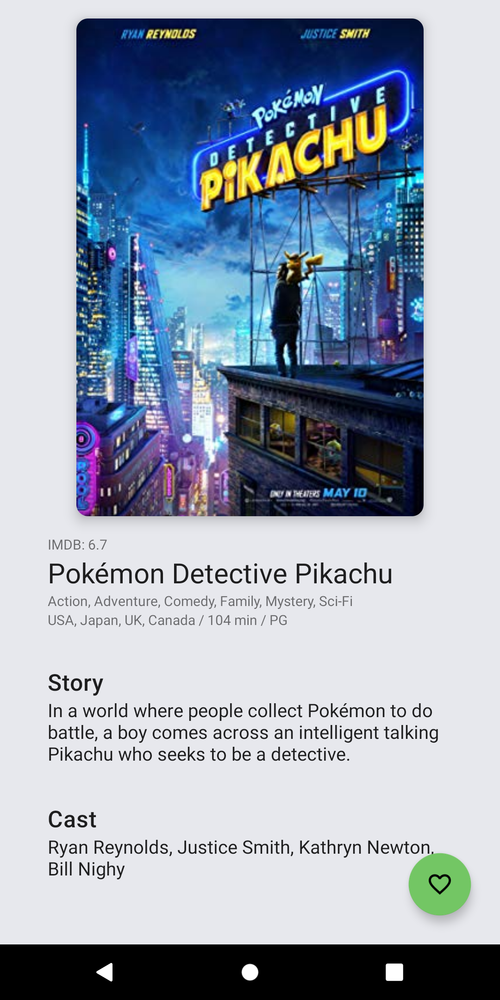
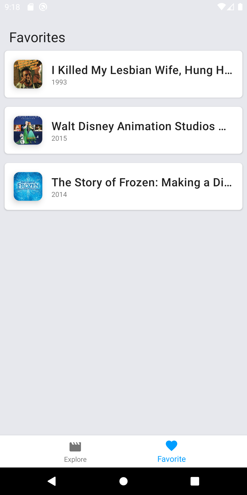
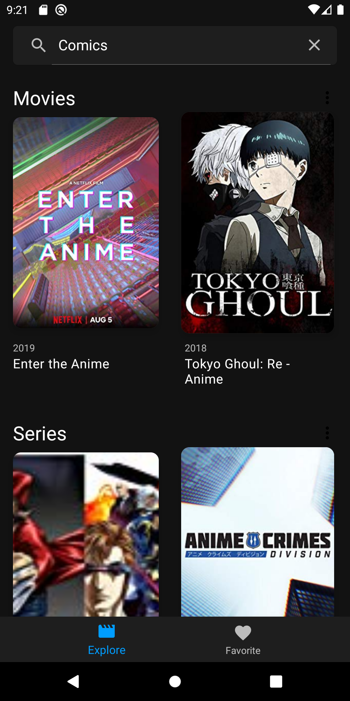
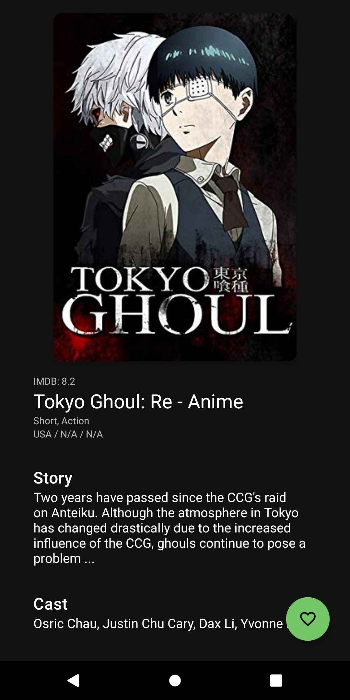
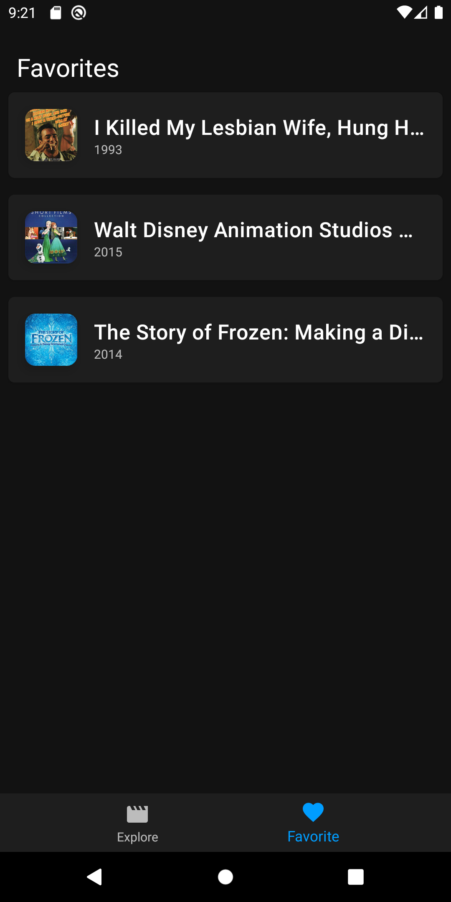

# LiberMovies

O aplicativo “LiberMovies” é um catálogo de Filmes e Séries onde o usuário pode buscar por nome, ver mais detalhes sobre o filme e salvar como favorito.

O aplicativo consume a API de filmes e séries OBMD (http://www.omdbapi.com/) e foi desenvolvida seguindo os princípios do Clean Architecture, separando em camadas de `Data`, `Domain` e `Presentation`.

- `Data` utiliza as bibliotecas Retrofit, para consumir a API externa, e Room (Google Architecture Components) para a persistência de dados, como a lista de `Favoritos`.

- `Domain` foi implementado os `Use Cases` com as regras que acessam a camada `Data` em busca dos dados, sejam externos ou locais. Realizando as tarefas de consulta de dados utilizando Coroutines, na thread IO e retornar os dados para thread MAIN com mapeamento dos tipos de erros (Auth, No Connetion, Message, others)

- `Presentation` é responsável por toda a parte visual do aplicativo, como Activities, Fragments, ViewModels e etc. Foi implementado seguindo os padrões da arquitetura MVVM e programação reativa (LiveData).
Também utilizando algumas bibliotecas como:
  - Data Binding: Para o binding direto dos modelos de dados com as interfaces visuais.
  - Glide: Carregamento de imagens.
  - Koin: Injeção de dependências.
  - Material: Componentes de UI do Android.
  
O aplicativo foi desenvolvido utilizando a linguagem Kotlin e toda as comunições entre as camadas são feitas através de Coroutines.

## Como utilizar

Insira a sua API_KEY do OMDB no arquivo `build.gradle` do módulo `Data`.

## Imagens

Default Mode theme  

 
Dark Mode Theme  

